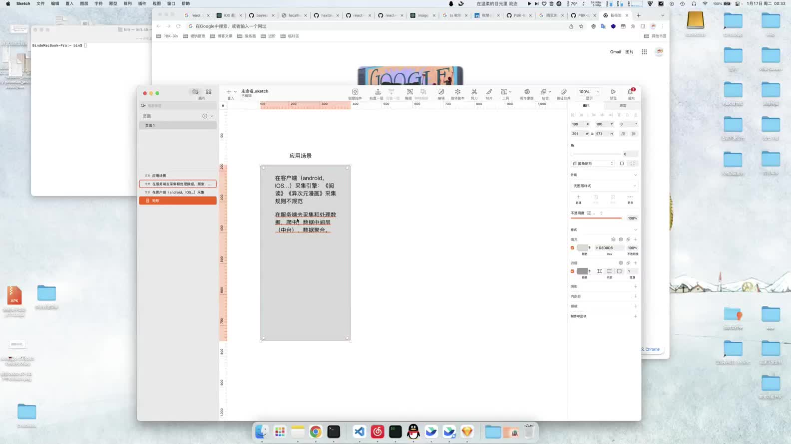

<!--
 * @Author: Bin
 * @Date: 2021-12-29
 * @FilePath: /Rivulet-Data-Android/README.md
-->
# Rivulet Data for android example - 溪流数据解析引擎 Android App 示例
> Rivulet 溪流数据引擎是一款跨平台多语言支持的统一数据解析规则的开源库，支持 DOM/Json/XML 数据结构解析规则。能够通过定义数据采集解析规则，轻松获取任何互联网数据，推动数据请求和解析的共享。

## 介绍 🪵
> **溪流数据解析引擎是个什么东西？**
> 
> **详细介绍：** 溪流数据解析引擎是能够通过一个接口能够统一的获取任何网络上的数据，然后清洗好数据后返回最后的数据结果。溪流数据解析引擎是目前计划是集成一个 SDK 适配 （API + JSON） and （Web + html）数据的统一采集和解析。可实现客户端层面采集解析数据，实现数据采集解析的规则共享，有利于互联网有效数据整合，畅想跨应用数据融合和数据采集规则统一导出导入方案，海量的互联网资源应用场景，下一代互联网资源应用技术蓝图

**详细介绍视频**

视频源地址:<https://zmstudio.feishu.cn/minutes/obcnt377yh7tjmn7p263kded>

## 系统 🪶
> 引擎采用 JSON 作为数据采集解析规则的定义。数据采集通常分为两个部分：
> - 数据获取（定义请求） 
> - 数据解析（清洗数据）
>

技术点解析图，采用集成 SDK 方式传入统一数据获取规则（使用 json 数据结构定义），将网络请求数据规则和数据清洗结合到一起（考虑到数据获取方式的多样性是不是可以考虑解耦，使引擎具有更高的可玩性），网络请求规则参考 Postman Collection v2.1 定义，数据清洗需要抽取 jq 和 jsoup 数据采集的共性研究出一套由 json 构建的数据解析规则（目的：自由，可修改，易扩展）。

## 领域 🌈
> 溪流数据解析引擎可以用来干什么？
>
> 可以使用户自定义客户端的数据采集接口，处理数据来源。开发者只需要提供一个数据呈现的客户端，一切数据来源都来自用户自定义的数据源。可用于的领域如：新闻，音乐，小说，视频，动漫，漫画，博客，网课，搜题…

> 愿景：下一代的移动互联网信息搜索应用应该由用户决定想要看到什么内容。

## 计划 🍪
- 完成 Rivulet Data for android example
- 封装 Rivulet Data SDK（Java 方向）
- 发布 Rivulet Data v1.0
- 撰写 Rivulet Data 数据引擎规则
- 建立 Rivulet Data 开源社区

## 致开发者们 ✨
> 我们欢迎任何形式的贡献，期待大家的加入一起完善和推动整个引擎的发展。
>
> 联系邮箱: <bin@PBK6.cn>
>
> 成员: [@123cdxcc](https://github.com/123cdxcc) | [@PBK-B](https://github.com/PBK-B) | [@ThankRain](https://github.com/ThankRain)
